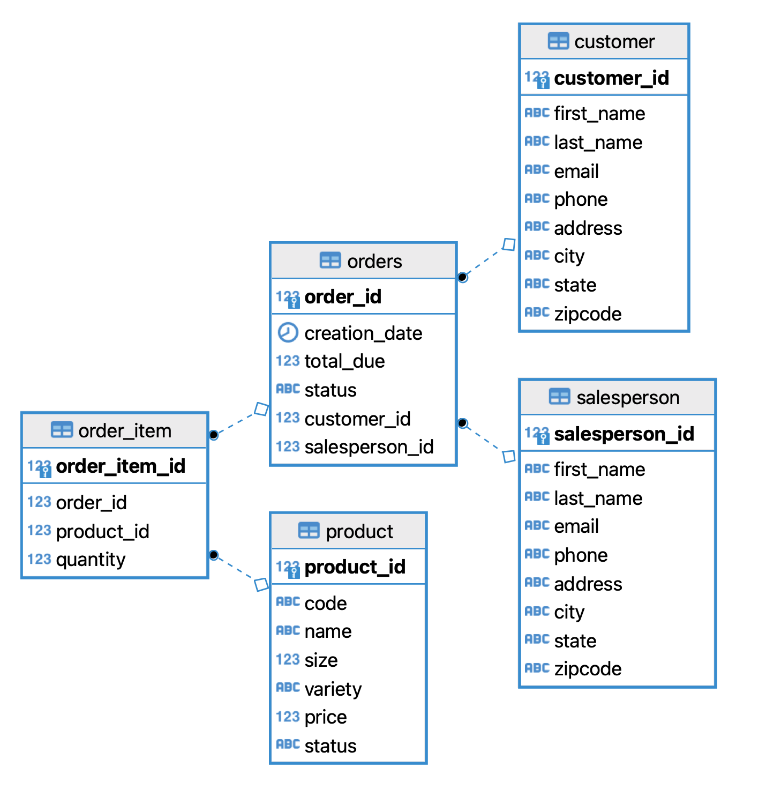

# Introduction
This is a JDBC App that allows the Java program to create a connection to an RDBMS which stores sales information.
It utilizes the connection pooling to simplify JDBC flow and Data Access Object (DAO) Pattern to abstract the data persistence and the underlying queries.
CustomerDAO and OrdersDAO are implemented to perform CRUD operations against the tables in the database system. 
Technologies used: Java, JDBC, PostgreSQL, Maven, slf4j Logger, DBeaver, Intellij

# Implementation
## ER Diagram

## Design Patterns
**DAO (Data Access Object) Pattern:**  
- DAO is a pattern used to abstract the data persistence in a software that manages connections to databases.
When it's used as an interface, the input and output will be a Data Transfter Object. DTO is a fully encapsulated object which provides single-domain of data.
DAO effectively encapsulates complex joins, pass, and aggregations. As an abstraction layer, it hides the ugly business queries and only provide functionality to the user. 

**Repository Pattern:**  
- The Repository pattern focuses on single table access per class. It is a higher abstraction layer that exists over the DAO layer.
  Implementation of repositories might have different DAOs as its members. Repository pattern allows you to shard your database so that
  accessing a single table is easier than the whole database. Because of this, in distributed database systems, this pattern is helpful as your store and manage shards of database horizontally. 

# Test
How you test your app against the database? (e.g. database setup, test data set up, query result)
The database is set up in a dockerized PostgreSQL instance. Inside the `JDBCExecutor` which is the class acting as the client, manual tests were done inside the `main` method. 