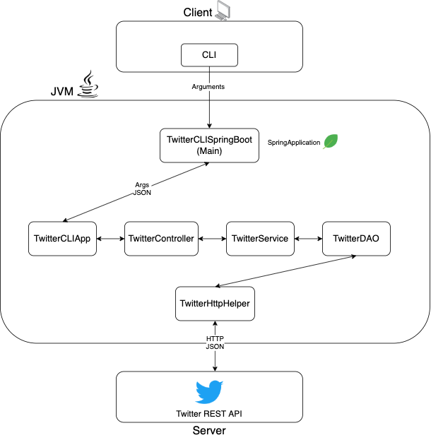

# Introduction
(50-100 words)
Twitter App is a Java app that allows users to post/show/delete a Twitter post using Twitter REST API. 
This app implements the MVC and DAO pattern to access Twitter REST API. A HttpClient will create a POST/GET/DELETE request, 
signed with the OAuth 1.0 authorization method, and send it to the Twitter server and get the response back in JSON, which is 
then parsed into a meaningful result for the users. Maven is used to manage project lifecycle and dependencies. 
The Spring framework is used to manage the dependency injection of the components. It is tested with Mockito, JUnit 4, and finally deployed by dockerizing it into an image and pushing it to the Docker Registry. <br>
**Technologies used:** Java, Apache Http, OAuth 1.0, Twitter REST API, MVC, DAO pattern, Spring, Docker, Maven 
# Quick Start
- Pull docker image from the registry <br>
`docker pull kimbrian94/twitter`
- Run the twitter docker app <br>

post <br>
tweet_text: tweet text cannot exceed 140 UTF-8 encoded characters. <br>
latitude:longitude: geo location <br>
```
docker run --rm \
-e consumerKey=YOUR_VALUE \
-e consumerSecret=YOUR_VALUE \
-e accessToken=YOUR_VALUE \
-e tokenSecret=YOUR_VALUE \
kimbrian94/twitter post [tweet_text] [latitude:longitude]
```
show <br>
id: Tweet ID. Same as id_str in the tweet object. <br>
\[field1,fields2]: A comma-separated list of top-level fields from the tweet object \[optional]
```
docker run --rm \
-e consumerKey=YOUR_VALUE \
-e consumerSecret=YOUR_VALUE \
-e accessToken=YOUR_VALUE \
-e tokenSecret=YOUR_VALUE \
kimbrian94/twitter show [id] [field1,field2]
```
delete
\[id1,id2]: A comma-separated list tweet object ids
```
docker run --rm \
-e consumerKey=YOUR_VALUE \
-e consumerSecret=YOUR_VALUE \
-e accessToken=YOUR_VALUE \
-e tokenSecret=YOUR_VALUE \
kimbrian94/twitter delete [id1,id2]
```

# Design
## UML diagram

## TwitterCLISpringBoot/Main
This layer is the top layer that the consumer calls using the command line interface. This main class will pass the tweet arguments for post/show/delete to the TwitterCLIApp object's run method down the architecture.
## TwitterCLIApp
TwitterCLIApp component will call the post | show | delete tweets method on the TwitterController object field and retrieve a Tweet object as result. Throw an exception if the arguments are incorrect.
## TwitterController
In this component layer, the arguments get parsed into an array of elements and call the TwitterService object post | show | delete methods passing the array and getting a Tweet object as result. eg. split by commas and colons.
## TwitterService
In this component layer, the business logic is handled by validating the id, fields, and tweet text. If they pass the validation, the TwitterDao object is called to access and make a request to the Twitter server.
1. When you post a tweet, the service layer is responsible to check if the tweet text exceeds 140 characters and if lon/lat is out of range.
2.  When you search for a Tweet, you need to check if user input IDs are in the correct format.
## TwitterDao
In this component layer, only the Twitter REST API is handled, not the business logic. This layer is in charge of creating the URI for the specific request calls and send it to the TwitterHttpHelper object. 
## TwitterHttpHelper
In this component layer, the HttpClient will set up the request using the passed arguments and with an OAuthConsumer object, the consumer keys and access tokens are used to sign the request. Which then successfully calls the Twitter REST API and returns the HTTP Response object.
## Models
A simplified version of the Tweet Object is modeled to contain the following properties
```json
{
   "created_at":"Mon Feb 18 21:24:39 +0000 2019",
   "id":1097607853932564480,
   "id_str":"1097607853932564480",
   "text":"test with loc223",
   "entities":{
      "hashtags":[],      
      "user_mentions":[]  
   },
   "coordinates":null,    
   "retweet_count":0,
   "favorite_count":0,
   "favorited":false,
   "retweeted":false
}
```
5 DTO(data transfer objects) are used as models: `Coordinates`, `Entities`, `Hashtag`, `Tweet`, and `UserMention`
## Spring
- The class dependencies are handled using the SpringBoot framework. All the components are annotated with `@Component` to tell the Spring runtime that it is a `Bean` to be maintained by IoC container.
Then the dependency relationships were specified above the class constructors with the `@Autowired` so that SpringApplication context manages that and injects them automatically using `@ComponentScan`.
Finally, the IoC container context is created in the main class.  

# Test
For each component, JUnit 4 and Mockito framework were used to run the Unit Test. Also, integration tests were done for each component using JUnit 4 as well.

## Deployment
Twitter App is dockerized into an docker image from the Dockerfile by running the following command 
```
mvn clean package
docker built -t kimbrian94/twitter . 
```
Then the Twitter App is pushed into the docker registry
```
docker push kimbrian94/twitter
```

# Improvements
- Instead of using Logger to show the Exception message, actually throw a RuntimeException to handle it.
- Implement a database connection using JDBC API to store the tweets locally.
- Make more meaningful test cases that cover more possibilities so the app is less error-prone.