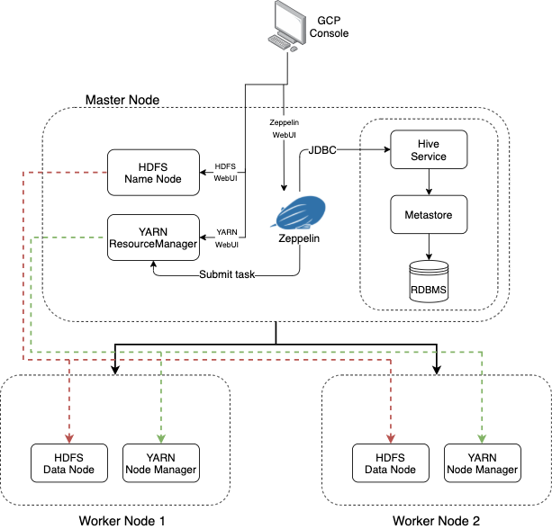

Table of contents
* [Introduction](#Introduction)
* [Hadoop Cluster](#Hadoop-Cluster)
* [Hive Project](#Hadoop-Project)
* [Improvements](#Improvements)

# Introduction
- In this project, the Jarvis data analytics team wants to move from SAP and R to the Hadoop ecosystem for processing big data. Used Apache Hadoop, HDFS, YARN, Hive, Zeppelin to process `World Development Indicators (WDI)` and generate meaningful insights
    - Provisioned Hadoop Cluster on GCP (Google Cloud Platform)
    - Solved business problems using Apache Hive and Zeppelin Notebook.

# Hadoop Cluster

## Big Data Tools
- HDFS: HDFS is Hadoop Distributed File System. It is distributed file system designed to hold a very large amount of data (terabytes or petabytes) and provide high-throughput access to this information.
    - Name Node: Namenode is where the metadata about the namespace of the files/directories are stored. It is in charge of the inserting, searching, and deleting of any file. Datanodes report to Namenode.
    - Data Node: Datanode is the physical storage in which the data is stored across the cluster.
- YARN: YARN is a Hadoop resource managing architecture that manages resources and allocates resources to each application accordingly.
    - ResourceManager: keeps track of live NodeManagers and available resources. Allocates available resources to appropriate applications and tasks. Monitors ApplicationMasters.
    - NodeManager: Provides computational resources in form of containers. Manages processes running in containers.
- Hive: Apache Hive is a framework for data warehousing on top of Hadoop. It was created to make working with queries/analysis easier for SQL-strong analysts. It has many similar characteristics to RDBMS with some differences.
    - Hive Client: Number of different mechanisms for connecting to Hive server from applications: Beeline(JDBC Driver), ODBC, Thrift
    - Hive Services: Metastore, FileSystem, Execution Engine.
    - Metastore: Hive metastore is the central repository of Hive metadata for the data warehouse.
- Apache Zeppelin: A web-based notebook that allows users to connect to Hive in a node, run data analysis, exploration, and visualization. 

# Hive Project

# Improvements
1. Optimize GDP queries even more with Parquet format.
2. Optimize other queries more with Spark query.
3. Make more comparisons with the data to gain insights.