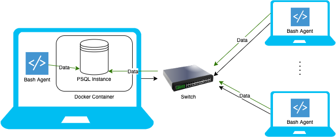

# Linux Cluster Monitoring Agent

# Introduction
This project implements automating monitoring agent which observes a cluster of Linux nodes/servers and record data from the nodes. The users are clusters of Linux servers internally connected by a switch which communicates using internal IPv4 addresses. This monitoring agent will capture the hardware specifications of each nodes and periodically insert node resource usuage into a RDBMS database. Using this monitoring agent and data it collects, you can solve important business problems involving resource planning such as increasing and decreasing number of nodes depending on the relative CPU/Memory usages.<br/>
Technologies used: <br/>
* Linux 
* GitFlow
* Bash Script
* Docker
* Postgresql

# Quick Start
Use markdown code block for your quick start commands
* Provision a docker psql instance on host computer by executing `psql_docker.sh`
```bash
    bash ./scripts/psql_docker.sh create|start|stop [username] [password]
```
* Create tables which will contain the hardware specifications and resource usages using `ddl.sql`
```bash
    psql -h localhost -U [username] -d [database] -f sql/ddl.sql
```
* Collect and insert host device hardware info into the `host_info` table
```bash
    bash ./scripts/host_info.sh localhost 5432 [database] [username] [password]
```
* Collect and insert host device cpu/memory usage into the `host_usage` table
```bash
    bash ./scripts/host_usage.sh localhost 5432 [database] [username] [password]
```
* Automate the host_usage.sh script with `crontab` CLI tool
```
    # Open crontab job file
    crontab -e
    
    # Add this task to the list and save
    * * * * * bash [full_directory_path]/host_usage.sh localhost 5432 [database] [username] [password] > /tmp/host_usage.log
```
# Implementation
- Inside one of the hosts in the Linux cluster, provision and run a PostgreSQL database instance containerizing it with docker using `psql_docker.sh`
- `host_info.sh` will gather the host hardware specification using `vmstat`, `df`, and `lscpu` and insert it into the PostgreSQL instance
- `host_usage.sh` will collect the real time cpu/memory resource usage of the host device and insert it into the PostgreSQL instance
  - using `crontab` the host will automate the insertion of usage data, every 1 minute.
## Architecture


## Scripts
- psql_docker.sh
    - This script takes `create | start | stop [username] [password]` arguments where each argument will create, start, or stop a PostgreSQL instance by using docker.
    - If the argument is `create` user must provide username and password as argument as well. If not it will exit with an error.
- host_info.sh
    - This script will parse hardware specification info into a INSERT statement and execute it to insert it inside the `host_info` table. 
- host_usage.sh
    - This script will parse CPU/Memory node resource usage into a INSERT statement and execute it to insert it inside the `host_usage` table.
- crontab
    - In order to consistently grab resource usage data from each node, add a job that runs `host_usage.sh` every 1 minute.
- queries.sql
    - These are some useful queries to use to solve some business problems
1. Group hosts by number of CPUs and Total Memory size in descending order
2. Get the average memory usage percentage in 5 minute interval for each hosts
3. Detect host/server failure by listing the specific 5 minute interval where the data entries are less than 3 (Consider this to be a failture)

## Database Modeling
`host_info` Table
| Columns | Values  |
| ------- | ------- |
| id | SERIAL NOT NULL PRIMARY KEY |
| hostname | VARCHAR NOT NULL UNIQUE |
| cpu_number | INT NOT NULL |
| cpu_architecture | VARCHAR NOT NULL |
| cpu_model | VARCHAR NOT NULL |
| cpu_mhz | FLOAT NOT NULL |
| L2_cache | VARCHAR NOT NULL |
| total_mem | INT NOT NULL |
| timestamp | TIMESTAMP NOT NULL |

`host_usage` Table
| Columns | Values  |
| ------- | ------- |
| timestamp | TIMESTAMP NOT NULL PRIMARY KEY |
| host_id | INT NOT NULL REFERENCES `host_info(id)` |
| memory_free | INT NOT NULL |
| cpu_idle | INT NOT NULL |
| cpu_kernel | INT NOT NULL |
| disk_io | INT NOT NULL |
| disk_available | VARCHAR NOT NULL |

# Test
How did you test your bash scripts and SQL queries? What was the result?

# Improvements
Write at least three things you want to improve 
e.g. 
- handle hardware update 
- blah
- blah
