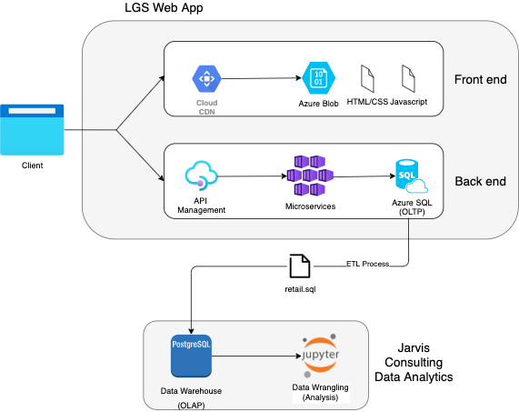

# Introduction
- London Gift Shop (LGS), a UK-based online store that sells gift-ware wants to utilize the latest data technologies to better understand their customer and make appropriate business decisions. LGS IT team engages with Jarvis Consulting services to achieve this. LGS will use this data analysis to develop targeted marketing campaigns.
- Technologies used: Python, Jupyter Notebook, Pandas, NumPy, Matplotlib, Data Warehouse (Postgres)

# Implementaion
## Project Architecture
- Because the Jarvis team is not allowed to work on LGS's cloud environment, the LGS team pulls the transaction data between 01/12/2009 and 09/12/2011 into a SQL file with the ETL process of removing client's personal information.
- From the `retail.sql` file, the data is dumped into a PostgreSQL data warehouse
- With the data from the data warehouse, using Pandas, NumPy, and Matplotlib, the data is analyzed and the results are visualized.
- Diagram  

## Data Analytics and Wrangling
- [Jupyter Notebook](./retail_data_analytics_wrangling.ipynb)
- To increase the revenue, look into the data of the new customers as they are the pool of potential consistent customers. Analyze the gift trend of the new users and promote the specified items through a one-time discount, or point system so that new users will stay to be existing users.
- Looking at the monthly trends, every last quarter, there is a significant increase in revenue. Analyze the source of the increase and focus of those items with new marketing tactics to maximize profit.

# Improvements
1. Request the LGS team to also provide the age info per invoices, and analyze any trend for each age group.
2. Look deeper into the canceled items and analyze the data set for any need for product recalls.