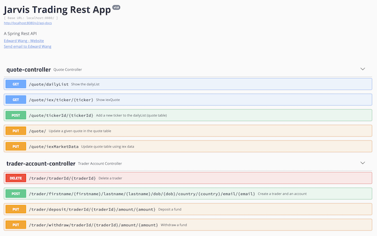

Table of contents
* [Introduction](#Introduction)
* [Quick Start](#Quick%20Start)
* [Implementation](#Implementation)
* [Test](#Test)
* [Deployment](#Deployment)
* [Improvements](#Improvements)

# Introduction
- This is a SpringBoot Trading Application for Jarvis which provides a new trading platform that replaces the legacy trading app. Because the previous app had monolithic architecture, 
  which was hard to maintain and scale, this new system will provide microservice architecture and SpringBoot framework for efficiency.
- This application is a RESTful API and can be consumed by various clients such as web/mobile applications. HTTP endpoints are used to help manage trader profiles, accounts, and trade securities.

- **Technologies Used**: Java, SpringBoot, REST API, Apache Tomcat, PostgreSQL, MVP, Docker, Maven, Swagger-Ui, Postman

# Quick Start
- Prequiresites: Docker, CentOS 7
- Pull images from docker hub
    - ```shell script
      docker pull kimbrian94/trading-app
      docker pull kimbrian94/trading-psql
      ```
- Create a docker network
    - ```
      sudo docker network create trading-net
      ```
- Start containers
    - ```shell script
      docker run --name trading-psql-dev \
      -e POSTGRES_PASSWORD=password \
      -e POSTGRES_DB=jrvstrading \
      -e POSTGRES_USER=postgres \
      --network trading-net \
      -d -p 5432:5432 kimbrian94/trading-psql
      ```
      ```shell script
      IEX_PUB_TOKEN="your_token"
      ```
      ```shell script
      docker run --name trading-app-dev \
      -e "PSQL_HOST=trading-psql-dev" \
      -e "PSQL_PORT=5432" \
      -e "PSQL_DB=jrvstrading" \
      -e "PSQL_USER=postgres" \
      -e "PSQL_PASSWORD=password" \
      -e "IEX_PUB_TOKEN=${IEX_PUB_TOKEN}" \
      --network trading-net \
      -d -p 8080:8080 -t kimbrian94/trading-app
      ```
- Try trading-app with SwaggerUI <br> http://localhost:8080/swagger-ui.html <br>



# Implementation
## Architecture

- **Controller layer**: In the controller layer, user inputs are parsed and appropriate methods are called based on the REST API endpoint.
    The endpoints are annotated in the class and method-level for the Tomcat WebServlet to redirect and call to.
- **Service layer**: In the service layer, the business logic is encapsulated. User input passed as arguments are validated and exceptions are handled if any error occurs.
- **DAO layer**: In the dao layer, HttpClient and DataSource(JDBC) objects are managed to connect to Web service or Database. CRUD operations and complex queries are contained. 
- **SpringBoot**: SpringBoot groups all controller/service/dao layers into one maintainable system. As part of the Springboot framework, Apache Tomcat/WebServlet listens for HTTP Requests
    and calls the appropriate controller method based on the endpoints. Also, the IoC container maintains and inject dependencies ie. `@Component`, `@Service`, etc
- **PSQL and IEX**: PSQL is the persistent data storage that consists of all the data tables. DataStore(JDBC) object communicates and runs CRUD operations on them.
    IEX is a web service that uses REST API to provide stock information in JSON format so that the users can consume and deserialize for their uses.
    This is a SpringBoot Trading Application for Jarvis which provides a new trading platform that replaces the legacy trading app. Because the previous app had monolithic architecture, 
    which was hard to maintain and scale, this new system will provide microservice architecture and SpringBoot framework for efficiency.
- This application is a RESTful API and can be consumed by various clients such as web/mobile applications. HTTP endpoints are used to help manage trader profiles, accounts, and trade securities.


## REST API Usage
### Swagger
- Swagger UI help to visualize and interact with the API’s resources. It’s automatically generated from your OpenAPI (formerly known as Swagger) Specification, with the visual documentation making it easy for back-end implementation and client side consumption.
### Quote Controller
- Quote Controller is used to getting market data from the IEX Cloud as well as updating and persisting them in the PSQL database instance as dailyList.
- Endpoints:
  - GET `/quote/iex/ticker/{ticker}`: Show iexQuote for a given ticker/symbol
  - PUT `/quote/iexMarketData`: Update quote table using iex data
  - PUT `/quote/`: Update a given quote in the quote table
  - POST `/quote/tickerId/{tickerId}`: Add a new ticker to the dailyList (quote table)
  - GET `/quote/dailyList`: Show the dailyList
### Trader Account Controller
- Trader Account Controller is used to manage trader and account information which are persisted in PSQL instances. It can deposit and withdraw funds from a given trader account. 
- Endpoints:
  - POST `/trader/firstname/{firstname}/lastname/{lastname}/dob/{dob}/country/{country}/email/{email}`: Create a trader and an account
  - DELETE `/trader/traderId/{traderId}`: Delete a trader
  - PUT `/trader/deposit/traderId/{traderId}/amount/{amount}`: Deposit a fund
  - PUT `/trader/withdraw/traderId/{traderId}/amount/{amount}`: Withdraw a fund

# Test 
Integration tests were run against the Dao, and Service layers within the IntelliJ IDE.
Endpoints of the Controller REST APIs are tested via Swagger-UI, Postman, and Linux `curl` cmd.

# Deployment

- During `docker build`, each `trading-psql` and `trading-app` images are built from the base psql and JDK8 images pulled from Docker Hub.
  - in psql `Dockerfile`, the `init_sql` initialization sql file is copied to the `/docker-entrypoint-initdb.d/`. So the database objects are initialized upon image creation.
- During `docker run`, `trading-psql-dev` and `trading-app-dev` containers are created and started on the `trading-net` network for communication.

# Improvements
- Implement a cyclical trigger that automatically updates the daily quote list, whenever market data changes.
- Notification or message to the user whenever there is a significant change in market data of daily list.
- Add more complex joins/queries logic in the dao layer for better analytics.