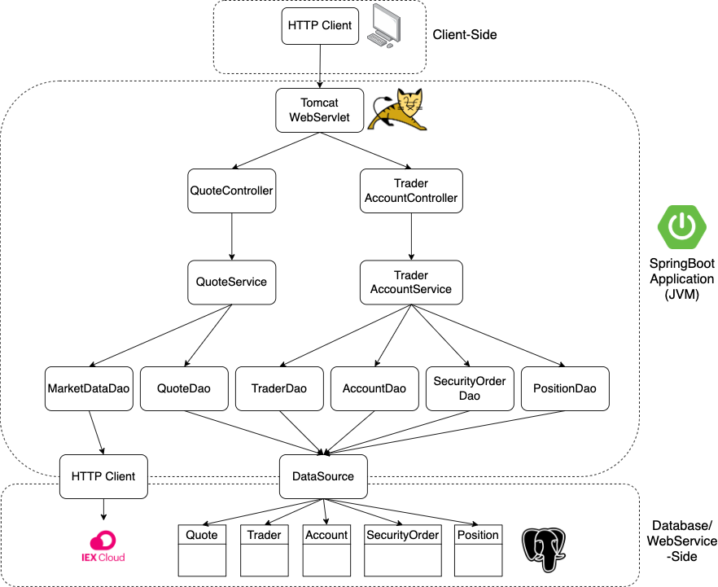

Table of contents
* [Introduction](#Introduction)
* [Quick Start](#Quick Start)
* [Implementation](#Implementation)
* [Test](#Test)
* [Deployment](#Deployment)
* [Improvements](#Improvements)

# Introduction
- This is a SpringBoot Trading Application for Jarvis which provides a new trading platform that replaces the legacy trading app. Because the previous app had monolithic architecture, 
which was hard to maintain and scale, this new system will provide microservice architecture and SpringBoot framework for efficiency.
- This application is a RESTful API and can be consumed by various clients such as web/mobile applications. Http end points are used to help manage trader profile, accounts, and trade securities.
- **Technologies Used**: Java, SpringBoot, REST API, Apache Tomcat, PostgreSQL, MVP, Docker, Maven, Swagger-Ui, Postman

# Quick Start
- Prequiresites: Docker, CentOS 7
- Docker scripts with description
	- build images
  - create a docker network
  - start containers
- Try trading-app with SwaggerUI (screenshot)

# Implementation
## Architecture
- 
- briefly explain the following components and services (3-5 sentences for each)
  - Controller layer (e.g. handles user requests....)
  - Service layer
  - DAO layer
  - SpringBoot: webservlet/TomCat and IoC
  - PSQL and IEX

## REST API Usage
### Swagger
What's swagger (1-2 sentences, you can copy from swagger docs). Why are we using it or who will benefit from it?
### Quote Controller
- High-level description for this controller. Where is market data coming from (IEX) and how did you cache the quote data (PSQL). Briefly talk about data from within your app
- briefly explain each endpoint
  e.g.
  - GET `/quote/dailyList`: list all securities that are available to trading in this trading system blah..blah..
### Trader Controller
- High-level description for trader controller (e.g. it can manage trader and account information. it can deposit and withdraw fund from a given account)
- briefly explain each endpoint
### Order Controller
- High-level description for this controller.
- briefly explain each endpoint
### App controller
- briefly explain each endpoint
### Optional(Dashboard controller)
- High-level description for this controller.
- briefly explain each endpoint

# Test 
How did you test your application? Did you use any testing libraries? What's the code coverage?

# Deployment
- docker diagram including images, containers, network, and docker hub
e.g. https://www.notion.so/jarviscanada/Dockerize-Trading-App-fc8c8f4167ad46089099fd0d31e3855d#6f8912f9438e4e61b91fe57f8ef896e0
- describe each image in details (e.g. how psql initialize tables)

# Improvements
If you have more time, what would you improve?
- at least 3 improvements